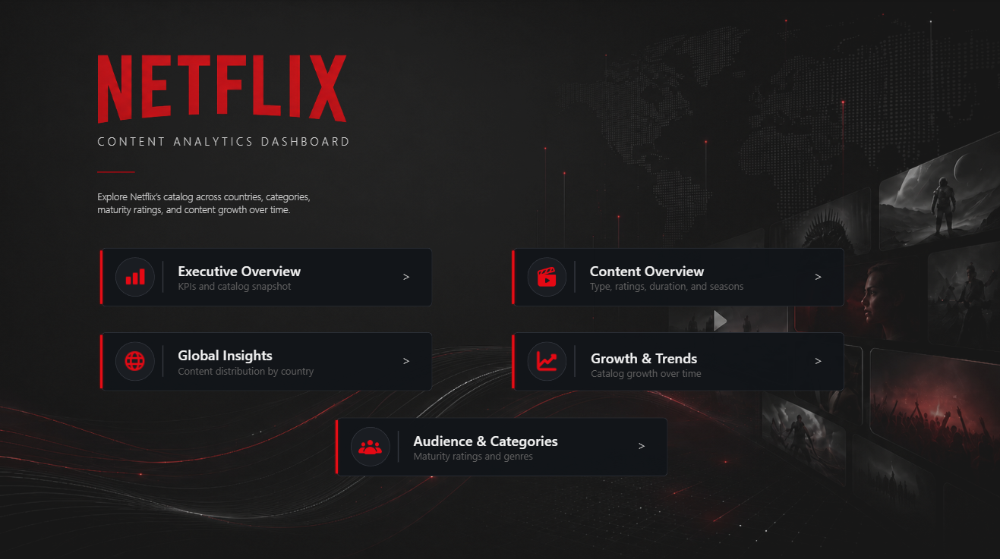
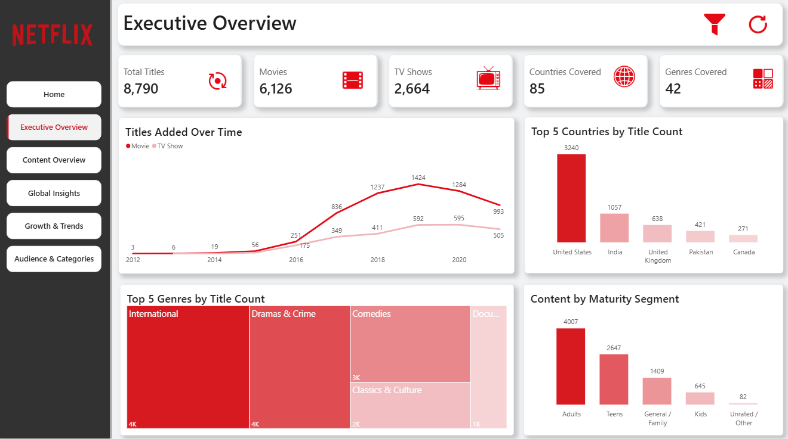
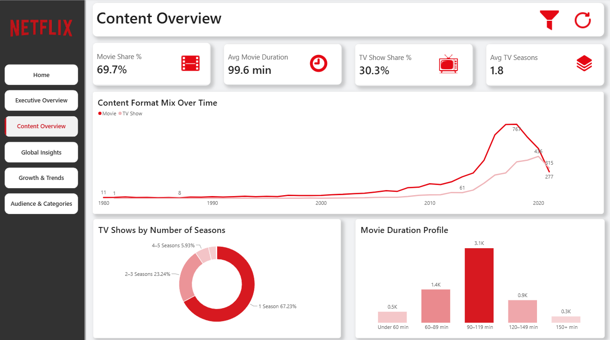
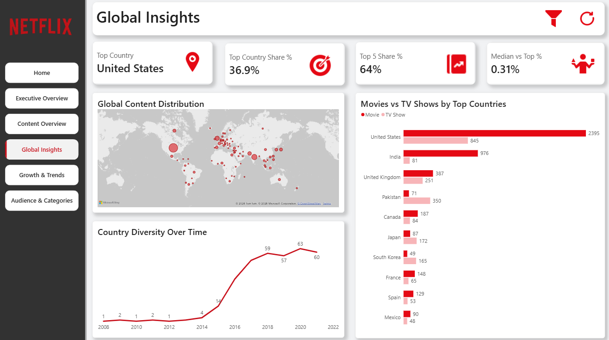
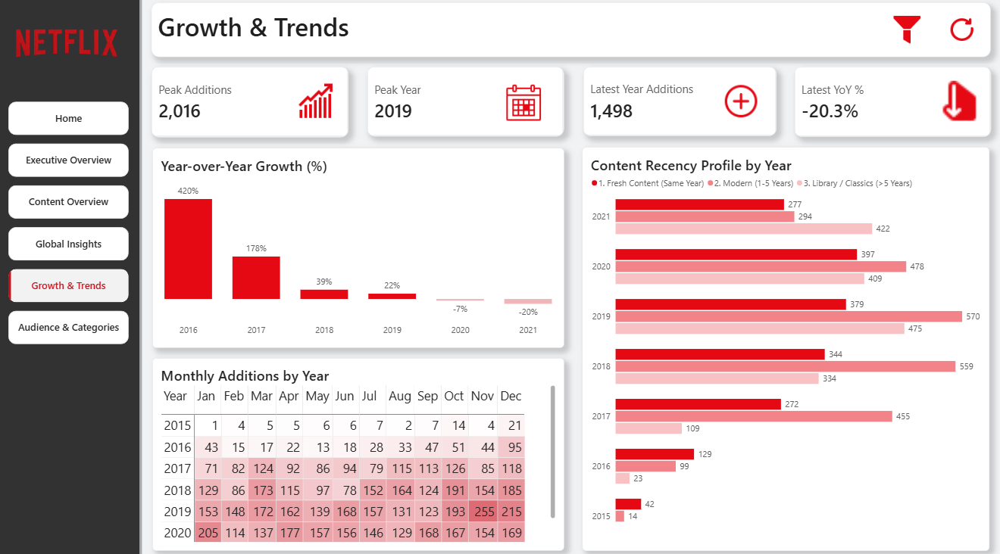
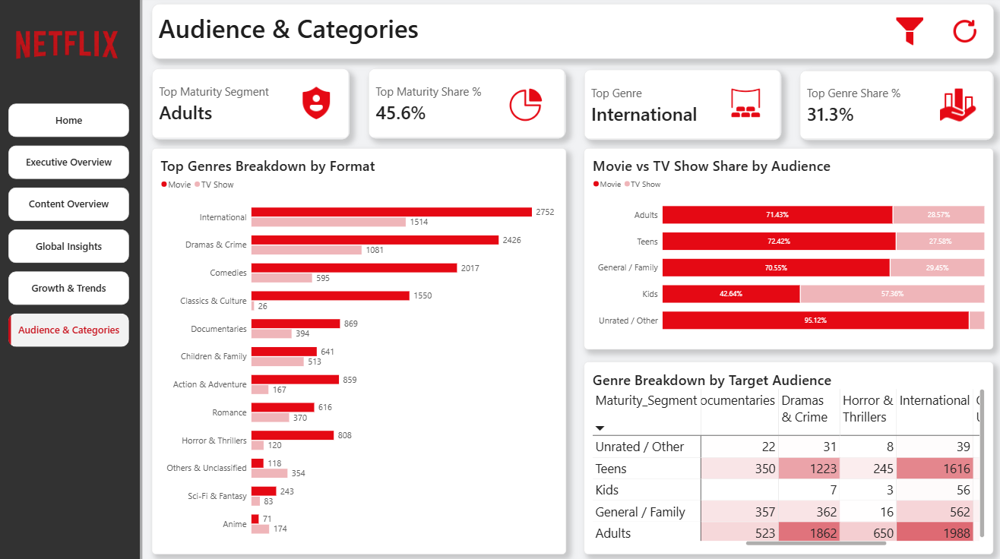
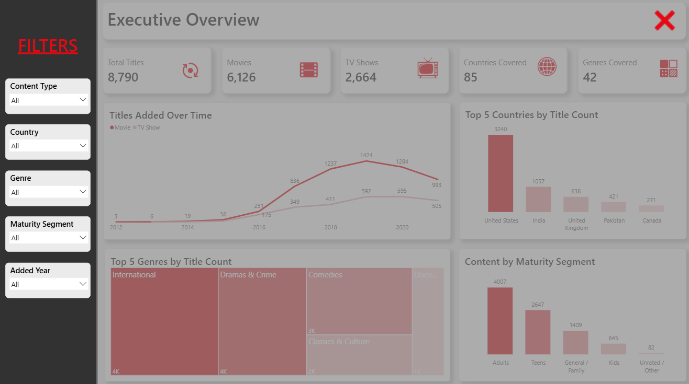

# 🎬 Netflix Content Analytics Dashboard

An interactive Power BI dashboard designed to explore and analyze the Netflix content catalog across content formats, geographic distribution, growth trends, maturity segments, and genres.

The project transforms raw Netflix catalog data into a structured analytical experience, allowing users to move from a high-level catalog overview to deeper insights into content composition, global presence, historical growth, and audience categories.

## 🎯 Project Objective

The objective of this project is to analyze Netflix's content catalog and answer key questions such as:

- How is the catalog divided between Movies and TV Shows?
- How has the content catalog evolved over time?
- Which countries contribute the most titles?
- How concentrated or geographically diverse is the catalog?
- What are the dominant genres and maturity segments?
- How do Movies and TV Shows differ across countries, genres, and audience categories?
- What patterns can be identified in content additions and content recency?

## 🛠️ Project Workflow

This project was built as an end-to-end Power BI analytics solution, covering the full process from raw data preparation to interactive dashboard design.

### 1. Data Cleaning & Transformation
The raw Netflix dataset was cleaned and transformed in Power Query to improve data quality and analytical usability.

Key preparation steps included:

- Converting `date_added` into a proper date data type.
- Handling missing and inconsistent values in fields such as country and director.
- Splitting multi-value fields into separate analytical tables.
- Creating dedicated bridge tables for:
  - Genres
  - Directors
- Cleaning and standardizing genre values for more meaningful analysis.
- Separating duration into analytical fields for Movies and TV Shows.
- Creating movie duration groups and TV season groups.
- Creating maturity segments from Netflix rating categories.
- Removing duplicate records and validating title-level uniqueness.

### 2. Data Modeling

The dataset was structured using a star-schema-inspired analytical model to improve filtering, maintainability, and report performance.

Main model components include:

- `Shows` as the central content table.
- `DimDate` as the dedicated date dimension.
- `ShowGenre` for multi-valued genre relationships.
- `ShowDirector` for director-level analysis.
- A dedicated `_Measures` table for centralized DAX measures.

Relationships were configured to support filtering across the report while preserving the correct analytical context.

### 3. DAX & Analytical Measures

Custom DAX measures were developed to support both descriptive and trend analysis, including:

- Total Titles
- Movies
- TV Shows
- Movie Share %
- TV Show Share %
- Average Movie Duration
- Average TV Seasons
- Countries Covered
- Genres Covered
- Top Country
- Top Country Share %
- Top 5 Share %
- Peak Additions
- Peak Year
- Previous Year Titles
- YoY Change %
- Latest YoY %
- Top Maturity Segment
- Top Genre
- Content Recency metrics

### 4. Interactive Report Experience

The report includes several interactive features designed to improve usability and exploration:

- Custom navigation across report pages.
- Page-specific filter panels.
- Bookmark-based filter open / close behavior.
- Reset-filter functionality.
- Edit Interactions configuration to preserve meaningful comparisons.
- Cross-filtering between visuals.

## 📊 Dashboard Structure

The dashboard is organized into five analytical pages, each designed to answer a different set of questions about the Netflix content catalog.

### 1. Executive Overview
Provides a high-level snapshot of the catalog, including total titles, Movies vs TV Shows, countries and genres covered, content additions over time, leading countries, top genres, and maturity distribution.

### 2. Content Overview
Focuses on the composition and characteristics of Movies and TV Shows, including content format share, average movie duration, average TV seasons, release trends, movie duration profiles, and TV show season distribution.

### 3. Global Insights
Explores the geographic distribution of the catalog, highlighting the leading country, geographic concentration, global content distribution, Movies vs TV Shows across major countries, and country diversity over time.

### 4. Growth & Trends
Analyzes how the catalog has evolved over time using peak additions, peak year, latest-year additions, year-over-year growth, monthly addition patterns, and content recency profiles.

### 5. Audience & Categories
Examines the catalog from an audience and genre perspective, including maturity segments, dominant genres, Movies vs TV Shows by audience, genre composition by format, and the relationship between genres and target audiences.

## 🔍 Key Insights & Findings

The analysis revealed several patterns across Netflix's content catalog:

- The catalog contains **8,790 titles**, consisting of **6,126 Movies** and **2,664 TV Shows**.
- Movies dominate the catalog, representing approximately **69.7%** of all titles, while TV Shows account for **30.3%**.
- The **United States** is the largest content contributor with **3,240 titles**, representing approximately **36.9%** of the catalog.
- The top five countries collectively account for approximately **64%** of the catalog, indicating a relatively high geographic concentration among leading markets.
- **International** is the largest genre group, while **Adults** is the dominant maturity segment, representing approximately **45.6%** of titles.
- The average Movie duration is approximately **99.6 minutes**, with the **90–119 minute** range representing the largest movie duration group.
- Approximately **67.2% of TV Shows have only one season**, while multi-season shows represent a considerably smaller share.
- Content additions reached their highest level in **2019**, with **2,016 titles added**.
- Growth slowed after the 2019 peak, with year-over-year additions declining in both **2020 and 2021**.
- The latest year in the dataset recorded **1,498 additions**, representing a **20.3% YoY decline**.
- Geographic diversity expanded substantially over time, with the number of represented countries increasing significantly compared with the early years of catalog additions.

## 🖥️ Dashboard Preview

### 🏠 Home

### 📊 Executive Overview

### 🎬 Content Overview

### 🌍 Global Insights

### 📈 Growth & Trends

### 👥 Audience & Categories

## 🎛️ Interactive Filtering Experience

Each analytical page includes a dedicated filter panel designed around the context of that page. The filtering experience was implemented using Power BI slicers, bookmarks, and controlled visual interactions.

The interface includes:

- Page-specific filter selections.
- Bookmark-based open and close behavior.
- One-click filter reset.
- Controlled visual interactions to preserve meaningful comparisons.
- A consistent filter-panel design across the report.

### Filter Panel Example

